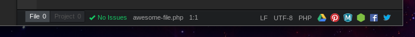

# Atom Hyperlinks
A package to display your essentials links in the status bar. Build width ecmascript6.

## Installing

Use the Atom package manager, which can be found in the Settings view or run
`apm install atom-hyperlinks` from the command line.

## Settings

Note: For view settings, `Packages -> atom-hyperlinks -> Configuration`

### List of links
An array of your essentials links.
* Key: `atom-hyperlinks.linksArray`
* Default: https://facebook.com ; https://twitter.com

## Coming Soon

### v0.1.0
- Add tooltips to links.
- Default icon if favicon not found.
- Select right or left position.
----
Feel free to open an issue to discuss potential features to add or improve.
